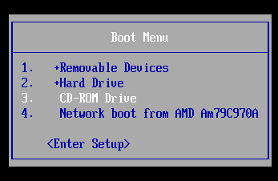

# Dev_Setup
Setup Development Environment

#Assignment: Setting Up Your Developer Environment

#Objective:

This assignment aims to familiarize you with the tools and configurations necessary to set up an efficient developer environment for software engineering projects. Completing this assignment will give you the skills required to set up a robust and productive workspace conducive to coding, debugging, version control, and collaboration.

#Tasks:

Sources: Documentation of vsCode,Python,dart,git,windows 11 and flutter

Select your Operating System (OS):

Windows 11

Choose an operating system that best suits your preferences and project requirements. Download and Install Windows 11. https://www.microsoft.com/software-download/windows11

Step 1: Create Windows 11 Installation Media

1. Download the Media Creation Tool:

https://www.microsoft.com/software-download/windows11 click the link

under the "Create Windows 11 installation Media" section and click the download button.

2. Run the Media Creation Tool:

Open the downloaded file and follow the prompts to create a bootable USB drive or ISO file.

Accept the license terms.

3. Set Up the Media Creation Tool:
Choose the language, edition, and architecture (64-bit) and press next.

Select the USB flash drive option and click next.

Insert a USB flash drive with at least 8 GB of storage.
Select the USB drive from the list and click "Next".

The tool will download Windows 11 and create the bootable USB drive.

After that click finish.

Step 2: Install Windows 11 Using the Installation Media

1.Prepare Your PC:
Back up all important data.

Ensure your PC meets the Windows 11 
system requirements.
https://www.microsoft.com/en-us/windows/windows-11-specifications  use this link to check the computer requirements.

2. Boot from the USB Drive:

Insert the bootable USB drive into your PC.
Restart your PC and enter the BIOS settings (usually by pressing F2, F12, or Del
keys).
Set the USB drive as the first boot device.
Save the changes and exit the BIOS settings.
Your PC will now boot from the USB drive.

Select your language and other preferences, and click "Next".

Accept the license terms and click "Next".
Select the "Custom: Install Windows only (advanced)" option.

Select the partition where you want to install Windows 11, and click "Next".

The installation process will begin, and your PC will restart several times.
After the installation is complete, you'll be prompted to set up your Windows 11
environment.
Follow the on-screen instructions to complete the setup process.
You have successfully installed Windows 11 on your PC.

# Windows11InstallationGuide
# Windows11
# MicrosoftWindows11
# Windows11Setup
# Windows11InstallationSteps
# Windows11Guide
# Windows11Tutorial
# Windows11InstallationTutorial

Install a Text Editor or Integrated Development Environment (IDE):

Select and install a text editor or IDE suitable for your programming languages and workflow. Download and Install Visual Studio Code. https://code.visualstudio.com/Download

Steps to Download and Install VS Code on Windows

1. Download VS Code:
Open a web browser and navigate to the VS Code download page: https://code.visualstudio.com/
Click on the "Download" button for Windows.

2. Run the Installer :
Open the downloaded file (VSCodeSetup.exe) and run the installer.
The installer wizard will appear.

3. Installation Prompt:

Accept the license agreement and click next.

Choose the location where you want the VS Code installation to be kept. Accept the default location and click next.

Select the components you want to install. You can choose to install the 32-bit or 64
bit version of VS Code. Click next.

Select whether you want to add VS Code to your PATH environment variable. Click next.

Select whether you want to create a desktop icon for VS Code. Click next.
 

 Installation Progress :
 click install
 The installation process will begin, and you'll see a progress bar.
 

4. Installation Complete :
The installation is complete. Click finish to close the installer wizard.

# VSCode
# VSCodeInstallationGuide

Set Up Version Control System:
Install Git and configure it on your local machine. Create a GitHub account for hosting your repositories. Initialize a Git repository for your project and make your first commit. https://github.com

sample Repo with git ignore: https://github.com/wycliff-ochieng/this-is-a-test-repo.git.

Step 1: Download and Install Git
Open a web browser and navigate to the Git download page: https://git-scm.com/downloads
Click on the "Download" button for Windows.

2. Run the Installer:

Open the downloaded Git installer.
Run the Git installer (Git-2.38.0-64-bit.exe).
The installer wizard will appear.
Accept the license agreement and click next.

Choose the location where you want the Git installation to be kept. Accept the default location and click next

Select the components you want to install. You can choose to install the Git Bash, Git GUI,
and other components. Click next.

Select whether you want to add Git to your PATH environment variable. Click next.

Select whether you want to create a desktop icon for Git. Click next.

3. Installation Complete :
The installation is complete. Click finish to close the installer wizard.

Verify the Installation:

Open Command Prompt or Git Bash and run 
git --version

This should display the version of Git installed on your system.
Admin@DESKTOP-3BE5PF9 MINGW64 /
$ git version
git version 2.45.2.windows.1

Admin@DESKTOP-3BE5PF9 MINGW64 /
$

Step 2: Configuring Git

Open a terminal or command prompt (Git Bash).
Set your username and email: [git config --global user. name "Your Name"
git config --global user.email "your_email@example.com"]

Step 3: Create a GitHub Account
Open a web browser and navigate to GitHub: https://github.com
Click on the "Sign up" button.
Fill in the required information, such as your username, email, and password.
Click on the "Create account" button.

Verify your email address by clicking on the verification link sent to your email.
Step 4: Initialize a Git Repository
Open a terminal or command prompt (Git Bash).
Navigate to the directory where you want to create your Git repository.
Run the command: git init
This will create a new Git repository in the current directory.

Step 5: Create a New File and Add it to the Repository
Create a new file in the repository directory using a text editor or IDE.
Add the file to the Git repository using the command: git add <file_name>

Commit the changes using the command: git commit -m "Initial commit"

Step 6: Link the Local Repository to GitHub
Create a new repository on GitHub by clicking on the "New" button.
Fill in the required information, such as the repository name and description.
Click on the "Create repository" button.
Copy the repository URL.

In the terminal or command prompt, navigate to the local repository directory.
Run the command: git remote add origin <repository_URL>

Run the command: git push -u origin master

This will push the local repository to GitHub and link the two repositories.
Step 7: Verify the Repository on GitHub
Open a web browser and navigate to GitHub.
Verify that the repository has been created and the file has been uploaded.

Congratulations! You have successfully set up a Git repository and linked it to GitHub.

Open Command Prompt or Git Bash and run
git --version
This should display the version of Git installed on your system.
admin@DESKTOP-3BE5PF9 MINGW64 /
$ git version
git version 2.45.2.windows.1

admin@DESKTOP-3BE5PF9 MINGW64 /
$

Install Necessary Programming Languages and Runtimes: Python, Dart, and Flutter SDK
Instal Python from http://wwww.python.org programming language required for your project and install their respective compilers, interpreters, or runtimes. Ensure you have the necessary tools to build and execute your code.

INSTALLING PYTHON step1: Download python installer

Go to https://www.python.org/downloads/
Download the latest version of Python for Windows.
Select the installer that corresponds to the version of Python you want to install.

Step 2: Run the Installer
Run the installer you downloaded.
Select the installation location and click "Next".

Select the components you want to install and click "Next".

Select the Start menu folder and click "Next".

Select whether to add Python to the PATH and click "Install".

Wait for the installation to complete.
Step 3: Verify Python Installation
Open Command Prompt or Git Bash and run
python --version
This should display the version of Python installed on your system.

Admin@DESKTOP-3BE5PF9 MINGW64 /
$ python --version
Python 3.12.4

Admin@DESKTOP-3BE5PF9 MINGW64 /
$

Install Dart and Flutter SDK

Step 1: Download Flutter SDK
Go to https://flutter.dev/docs/get-started/install/
Download the Flutter SDK for Windows.
Select the installation location and click "Next".

Step 2: Extract the Flutter SDK
Extract the Flutter SDK to the selected location.

Step 3: Update the System Environment Variables
Right-click on "Computer" or "This PC" and select "Properties".
Click on "Advanced system settings" on the left side.
Click on "Environment Variables".
Under "System Variables", scroll down and find the "Path" variable, then click "Edit".
Click "New" and add the path to the Flutter SDK's bin folder (e.g., C
\flutter\bin).
Click "OK" to close all the windows.
Step 4: Verify Flutter Installation
Open Command Prompt or Git Bash and run
flutter doctor
This should display the Flutter doctor report, which checks for any issues with your Flutter installation.
Verification of dart
Open Command Prompt or Git Bash and run
dart --version
This should display the version of Dart installed on your system.
okemw@DESKTOP-3BE5PF9 MINGW64 /
$ dart --version
Dart VM version: 2.19.1 (Wed Sep 14 14:31
okemw@DESKTOP-3BE5PF9 MINGW64 /
$ flutter doctor
Flutter is installed and configured correctly.
okemw@DESKTOP-3BE5PF9 MINGW64 /

DOWNLOADING DART
Step 1: Download Dart SDK
Go to https://dart.dev/get-dart
Download the Dart SDK for Windows.
Select the installation location and click "Next".

Step 2: Extract the Dart SDK
Extract the Dart SDK to the selected location.
Step 3: Update the System Environment Variables
Right-click on "Computer" or "This PC" and select "Properties".
Click on "Advanced system settings" on the left side.
Click on "Environment Variables".
Under "System Variables", scroll down and find the "Path" variable, then click "Edit"
Click "New" and add the path to the Dart SDK's bin folder (e.g., C
\flutter-sdk\bin).
Click "OK" to close all the windows.
Step 4: Verify Dart Installation
Open Command Prompt or Git Bash and run
flutter --version
This should display the version of Dart installed on your system.
okemw@DESKTOP-3BE5PF9 MINGW64 /
$ flutter --version
Flutter 3.22.2 • channel stable • https://github.com/flutter/flutter.git
Framework • revision 761747bfc5 (13 days ago) • 2024-06-05 22:15:13 +0200
Engine • revision edd8546116
Tools • Dart 3.4.3 • DevTools 2.34.3

install Package Managers:
If applicable, install package managers like pip (Python).

Python (pip)

check the python version in git by running the command 
python --version

it will display the python version
okemw@DESKTOP-3BE5PF9 MINGW64 /
$ python --version
Python 3.12.4

Admin@DESKTOP-3BE5PF9 MINGW64 /

install pip

python -m ensurepip

if  pip is installed this will be displayed:

Admin@DESKTOP-3BE5PF9 MINGW64 /
$ python -m ensurepip
Looking in links: c:\Users\okemw\AppData\Local\Temp\tmpsha5o21w
Requirement already satisfied: pip in c:\users\okemw\appdata\local\programs\python\python312\lib\site-packages (24.0)

Configure a Database (MySQL):

Download and install MySQL database.
https://dev.mysql.com/downloads/windows/installer/5.7.html

1. Download MySQL

Go to the MySQL Community Downloads page.https://dev.mysql.com/downloads/installer/
Download the latest version of MySQL for Windows.
Select the installer that corresponds to the version of MySQL you want to install.

2. Install MySQL
Run the installer and follow the installation wizard's instructions.
Select the installation location and click "Next".

Select the components you want to install and click "Next".

Select the installation type and click "Next".

Select the root password and click "Next".

Select the default character set and click "Next".

Select the Windows service and click "Next".

Click "Execute" to start the installation.

Finish
Finally, click "Finish" to complete the installation

Set Up Development Environments and Virtualization (Optional):
Consider using virtualization tools like Docker or virtual machines to isolate project dependencies and ensure consistent environments across different machines.
Docker
Install Docker Desktop on your machine.
https://www.docker.com/get-started/
Create a Dockerfile for your project to define the environment and dependencies.
Run the Docker container using the Dockerfile.
Virtual Machines
Install a virtual machine software like VirtualBox or VMware.
Create a virtual machine with the desired operating system and configuration.
Install the necessary dependencies and tools within the virtual machine.
Install Python and pip
python -m ensurepip

Explore Extensions and Plugins:
Explore available extensions, plugins, and add-ons for your chosen text editor or IDE to enhance functionality, such as syntax highlighting, linting, code formatting, and version control integration.

Visual Studio Code (VS Code) Extensions VS Code is a highly customizable text editor with a vast ecosystem of extensions. Here are some essential extensions:
1. Python Extension Pack: Provides syntax highlighting, linting, and debugging capabilities for Python.
2. Code Runner: Allows you to run code in the editor with a single click.
3. Debugger for Python: Enables debugging Python code with breakpoints, variable inspection, and more.
4. Python Test Explorer: Provides a test explorer for Python, allowing you to run and debug tests
5. Jupyter Notebook Viewer: Enables viewing and editing Jupyter Notebooks within VS Code.
6. GitLens: Enhances Git functionality with features like code lens, commit history, and more
7. Pylance: Provides advanced Python language support, including type checking, code completion, and
linting.
8. Python Indent: Automatically formats Python code with proper indentation.
PyCharm Plugins PyCharm is a popular IDE for Python development. Here are some essential plugins
1. Python Console: Provides an interactive Python console within PyCharm.
2. Python Debugger: Enables debugging Python code with breakpoints, variable inspection, and more.
3. Python Code Analysis: Offers code analysis, inspections, and quick fixes for Python code.
4. Python Code Completion: Provides advanced code completion, including type hints and docstrings.
5. Python Refactoring: Enables refactoring Python code with features like rename, extract function, and  
more.
6. Python Testing: Supports testing Python code with frameworks like unittest and pytest.
7. Python Profiler: Profiles Python code to identify performance bottlenecks.

Reflection on Challenges
Challenges Faced:
1. **Setting up the environment**: Installing Python, pip, and necessary dependencies was a challenge,
especially for those new to Python development.
2. Docker: Installing and configuring Docker took some time.
3. MySQL Installation: Configuring the MySQL server and setting up the root password was challenging without prior database experience.

Solutions:
Python: Added Python to the PATH environment variable.
Docker: Followed detailed tutorials and referred to Docker documentation.
MySQL: Used MySQL official documentation and community forums for troubleshooting.

Document Your Setup:
Create a comprehensive document outlining the steps you've taken to set up your developer environment. Include any configurations, customizations, or troubleshooting steps encountered during the process.

#Deliverables:

Document detailing the setup process with step-by-step instructions and screenshots where necessary.

A GitHub repository containing a sample project initialized with Git and any necessary configuration files (e.g., .gitignore). https://github.com/Johnnytash/this-is-a-test-repo.git

A reflection on the challenges faced during setup and strategies employed to overcome them.

#Submission: Submit your document and GitHub repository link through the designated platform or email to the instructor by the specified deadline.

#Evaluation Criteria:**

Completeness and accuracy of setup documentation.
Effectiveness of version control implementation.
Appropriateness of tools selected for the project requirements.
Clarity of reflection on challenges and solutions encountered.
Adherence to submission guidelines and deadlines.
Note: Feel free to reach out for clarification or assistance with any aspect of the assignment.
